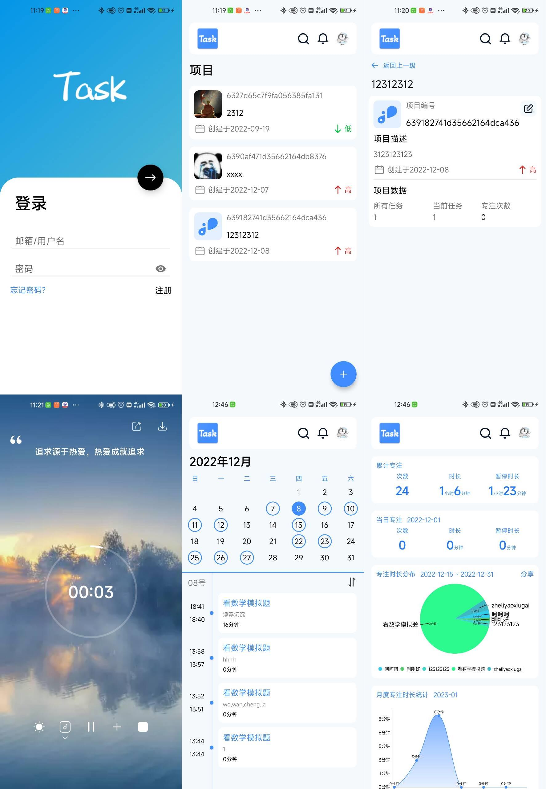

## 简介

个人任务管理App

后端是使用: https://www.leancloud.cn/

下载地址: https://www.pgyer.com/sUJR

## 功能
* 记录任务
* 专注模式
* 日程
* 统计数据
* 白噪音
* 心得记录

## UI

## 联系我

* QQ：2928527233
* CSDN：https://blog.csdn.net/weixin_51298509

